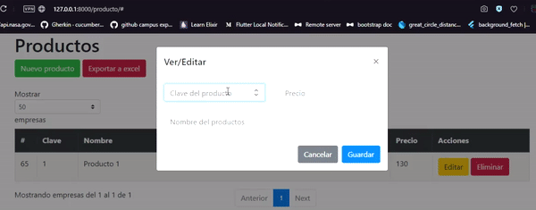
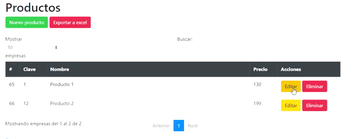
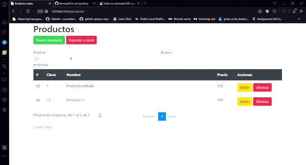

# CRUD Symfony

### Registro de productos

### Edición de productos

### Eliminación de productos

#### Dependencias usadas:

* [Serializer](https://symfony.com/doc/current/components/serializer.html)
* [Phpspreadsheet](https://phpspreadsheet.readthedocs.io/en/latest/)

#### Configuración

Crear un archivo **.env** para añadir la configuración de la base de datos, más información en este [enlace](https://symfony.com/doc/current/configuration.html)

